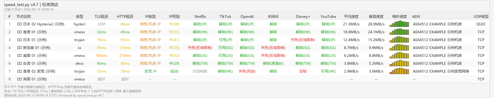

> Language / 语言: [English](README_EN.md) | [中文](README.md)

# Airport Speed Test

Pull all nodes from an airport subscription, test latency, speed, streaming unlock and IP quality in one go, and get a visual report automatically. No need to understand mihomo config — you'll know which node to use.

[](LICENSE)
[](https://github.com/oscyfmau/airport-speedtest/releases)
[](https://www.python.org/downloads/)
[](https://github.com/oscyfmau/airport-speedtest/releases)

Version: v4.43.0 | Repository: [github.com/oscyfmau/airport-speedtest](https://github.com/oscyfmau/airport-speedtest) | [Changelog](CHANGELOG.md)

> This project was written by AI and developed for personal needs — take it as-is.

## Preview



(Sample report; data is for demonstration purposes)

## Quick Start (3 Steps, No Command Line Skills Needed)

1. **Download**: open the [Releases page](https://github.com/oscyfmau/airport-speedtest/releases), download the latest `airport-speedtest-v4.42.0.zip` (a slim package with everything needed to run), unzip it, then read `使用教程.txt` inside first (if you know git you can also `git clone`)
2. **Fill in the subscription**: in the unzipped folder, copy `代理.txt.example`, rename it to `代理.txt`, open it with Notepad, paste your subscription link and save
   - What is a subscription link? A URL provided by your airport service provider (usually starts with `https://` and contains all node info); get it from the "Copy subscription" option on the airport website or in the client app
3. **Run**:
   - Install Python 3.9+ ([python.org](https://www.python.org/downloads/), check "Add python.exe to PATH" during installation)
   - In the unzipped folder run `pip install -r core/requirements.txt`
   - Double-click `run.bat` → select `2` Download speed in the menu → wait a few minutes → the PNG report opens automatically (report files are in the `output/` folder, logs are in the `log/` folder)

The mihomo core downloads automatically on first run to `bin/` (about 47MB) — no manual download needed.

> [!IMPORTANT]
> Subscription links contain account tokens: `代理.txt` stays local only (already in .gitignore) — never share it publicly. The tool itself also auto-masks subscription tokens in logs and exception records.

> [!NOTE]
> Speed tests consume node traffic (about 10-30MB per node); standard tests also run a web page simulation per node (about 3-8 extra seconds). For nodes marked "no heavy traffic", use `--fast` or avoid full tests.

## Features

- Protocol parsing: 20+ protocols (vmess / vless / trojan / ss / ssr / hysteria2 / tuic / wireguard / anytls etc.), multiple subscription URLs merged and de-duplicated
- TCP latency: local direct handshake + mihomo tunnel probe cross-check; packet loss counted across 3 handshakes (latency column shows `312ms(1lost)`)
- Speed test: nodes tested serially without interference; 4 connections per node across 3 download sources (Cloudflare/CacheFly/OVH); 8s window, first-second slow start stripped
- Streaming unlock: 33 platforms, 10 dedicated detectors (Netflix/Disney/YouTube/Bilibili TW-HK-MO/TikTok/Steam etc.); dead nodes skipped early
- IP quality: type (residential/DC/proxy/mobile) + ASN + risk score 0-100; ip-api.com primary, ipapi.is / ipwho.is / api.ip.sb fallback
- Reuse detection in 4 tiers: full reuse / transit reuse / exit reuse — spot shared airport lines at a glance (inspired by SSRSpeedN)
- Web page simulation: 4 representative sites loaded concurrently, first-byte latency recorded; CN exits auto-switch to domestic sites (Baidu/Bilibili/Tencent)
- Retest mechanism: timed-out nodes are retested before the report; recovered nodes get a re-run speed test
- Output: PNG visual report (full-cell color blocks + per-second speed bars + white grid lines) + JSON data + JSONL structured logs (subscription tokens auto-masked)
- Console experience: per-UA feedback while parsing the subscription, real-time per-node result lines during speed tests, per-stage summaries, and a TOP-5 console ranking at the end (results visible even without opening the PNG); progress bars disappear after each stage without residue
- Menu management: filtered speed tests (by node-name keywords / first N nodes), history management (open/delete reports), subscription management (masked view/add/delete), settings page (speed window / parallelism / auto-open report, persisted across sessions), environment info page

## Installation & Running

### Environment Requirements

- Windows 10+ (x86_64 / arm64) — **the only platform actually tested** (full regression verified)
- Linux (x86_64 / arm64) and macOS (Intel / Apple Silicon) — written cross-platform and statically reviewed, but **NOT actually tested**; report issues at [Issues](https://github.com/oscyfmau/airport-speedtest/issues) with the latest `log/` jsonl
- Python 3.9+
- Dependencies: `pip install -r core/requirements.txt`
- The mihomo core downloads automatically on first run to `bin/` (about 47MB), no manual download needed

### Getting the Code

Either of the two ways:

- No git: go to the [Releases page](https://github.com/oscyfmau/airport-speedtest/releases), download the latest `airport-speedtest-v4.42.0.zip` (slim package, run core files only) and unzip it; download `Source code (zip)` instead only if you want to modify the code
- With git:

```bash
git clone https://github.com/oscyfmau/airport-speedtest.git
cd airport-speedtest
pip install -r core/requirements.txt
```

### How to Run

Double-click `run.bat` for the interactive menu, or run directly from the command line:

| Command | Description |
|---|---|
| `python core/speed_test.py` | Interactive menu (same as double-clicking run.bat) |
| `python core/speed_test.py <URL>` | Direct speed test (simple mode: TCP ping + HTTP speed) |
| `python core/speed_test.py <URL> --full` | Full test (+ streaming unlock + IP quality + web page simulation) |
| `python core/speed_test.py <URL> --fast` | Fast mode (5s speed window / skip IP check) |
| `python core/speed_test.py <URL> --workers N` | Streaming/IP/webpage parallelism (1-8, default 4; speed tests always serial) |
| `python core/speed_test.py -i file.txt` | Read multiple subscription URLs from a file (one per line) |
| `python core/speed_test.py --report` | Open the last report |
| `python core/speed_test.py --menu` | Force show the menu |
| `python core/speed_test.py -h` | Show help |

> Tip: with `--full` combined with `--fast`, fast mode wins — 5s speed window and IP quality + web page simulation are skipped (streaming checks still run).

```bash
python core/speed_test.py https://your-subscription --fast   # quick scan in ~5 minutes
python core/speed_test.py https://your-subscription --full   # full report
```

Subscription URLs are read by default from `代理.txt` at the project root (one URL per line). The repo does not include this file: copy `代理.txt.example` to `代理.txt` and fill it in (it is already in .gitignore, so it will not be committed by mistake).

### Menu Mode

The menu has three levels (since v4.29.0): level 1 = test entries, level 2 = auxiliary features, level 3 = maintenance.

| Level 1 menu | Description |
|---|---|
| 1. Standard test | Speed test + 8 common streaming platforms + IP quality + web page simulation |
| 2. Download speed | TCP detection + HTTP speed test (fastest, least traffic) |
| 3. AI websites | 8 AI platform checks |
| 4. All streaming | All 33 platforms |
| 5. Quick check | Parallel approximate speed test + 4 core streaming platforms (YouTube/Netflix/Disney+/ChatGPT); speeds are order-of-magnitude references only (available since v4.30.0) |
| 6. More | Enter the level-2 menu |
| 0. Exit | Exit the program |

| Level 2 menu "More" | Description |
|---|---|
| 1. Node stability | Node profile view: evergreen / roller-coaster / newcomer / normal tiers, appearance rate over the last N runs, reachability, average speed and volatility (N adjustable in Settings) |
| 2. Result comparison | Compare two test runs: speed/latency/unlock/rank diffs, >20% marked ↑↓, peak hours auto-annotated (available since v4.30.0) |
| 3. Subscription comparison | Cross-airport comparison: node count / avg speed / max speed / unlock rate / avg latency / avg risk (unlock rate excludes skipped & errors; available since v4.31.0) |
| 4. Filtered speed test | Filter nodes by name keywords (e.g. `香港 JP`) or first N nodes (`N=10`), then choose simple/standard/quick mode |
| 5. View last result | Open the latest PNG report in the output folder |
| 6. Result management | List the latest 15 reports in output (time/mode); type a number to open, `D<number>` to delete |
| 7. Subscription management | Masked view of 代理.txt URLs; add (deduped), delete, or open the file in Notepad |
| 8. Settings | Speed window seconds (3-30, default 8), parallelism (1-8, default 4), auto-open report, stability window (5/10/20, default 10), large-run confirm (>50 nodes) toggle, keep reports (10/30/100, default 30) and keep logs days (7-365, default 30); saved to `~/.airport_speedtest.json` across sessions |
| 9. Maintenance | Enter the level-3 maintenance menu |
| 0. Back | Return to the level-1 menu |

| Level 3 menu "Maintenance" | Description |
|---|---|
| 1. Update core | Download the latest mihomo core (shows current/target version; downloads first, then replaces) |
| 2. Environment info | Tool/Python/dependency/mihomo versions, subscription count, report & log file counts |
| 3. Clean old reports | Shows space used and what would be deleted, then confirms; auto-cleanup runs silently after every test (available since v4.31.0; retention counts/days adjustable in Settings) |
| 0. Back | Return to the level-2 menu |

The menu header shows the subscription-file status and a summary of the last run; **when 代理.txt contains multiple subscriptions, the tool lists them and asks you to choose before each test** (comma-separated multi-select, Enter = all); press Ctrl+C during a test to interrupt (a partial report is generated); on level 1 press Ctrl+C once to return to the menu and twice to exit, on levels 2/3 press Ctrl+C once to go back one level.

### Sample Console Output

(Excerpt from a `--fast` run; values vary by network. Node flags display as country codes in the console; per-node result lines during the speed-test stage have no timestamps.)

```
2026-08-01 21:30:05 INFO  Parsing subscription: https://example.com/api/***
2026-08-01 21:30:06 INFO  UA curl/8.0 parsed 33 nodes
2026-08-01 21:30:08 INFO  [OK] parsed 33 nodes
2026-08-01 21:30:09 INFO  [1/2] TCP ping latency test
2026-08-01 21:30:11 INFO  TCP detection done: 26/33 reachable directly
[1/33] [JP] 日本-东京-01                    45ms    21.3MB/s
[2/33] [HK] 香港-荃湾-02                    62ms    15.8MB/s
[3/33] [US] 美国-洛杉矶-03                 168ms     9.2MB/s
2026-08-01 21:33:52 INFO  Speed test done: 30/33 ok | fastest 34.5MB/s ([JP] 日本-东京-01) | avg 8.1MB/s
2026-08-01 21:33:52 INFO  Test finished in 227s, 33 nodes total
2026-08-01 21:33:52 INFO  Report: output/测速结果_fast_20260801_213352.png
Node name                         Latency  HTTP    Avg       Max
[JP] 日本-东京-01                   45ms   118ms   21.3MB/s   34.5MB/s
[HK] 香港-荃湾-02                   62ms   151ms   15.8MB/s   28.1MB/s
[US] 美国-洛杉矶-03                168ms   201ms    9.2MB/s   12.6MB/s
... 33 nodes total, full results in the report
```

## Test Flow

```
Subscription URL(s) (captures subscription-userinfo) → parse with multiple UA attempts → TCP detection (direct concurrent + 3 retries for loss | mihomo tunnel concurrent probe)
→ HTTP speed test (nodes serial, 4 connections per node, multi-source aggregation, 8s window) → retest timed-out nodes (direct + tunnel retry, recovered nodes re-tested)
→ streaming unlock (pre-check first 3 services, skip dead nodes) → IP quality (multi-source fallback) → web page simulation (CN exit switches to domestic sites)
→ reuse tiers → PNG + JSON export
```

## Report Terminology

The report colors follow intuition (green/blue = fast/good, orange/pink = slow/bad). All text is drawn in pure black with no outline, and no color legend is printed inside the report; full-cell color blocks express quality, numbers are only for precise reading.

### Color Meaning (v4.43.0 MiaoKo Blue-green style)

| Column | Color block |
|---|---|
| RTT / HTTP latency / Web Avg | Full-cell block: fast = bright green `#4DD06F` → mid = yellow-green `#8BC34A` → slow = deep orange `#FF7000` (linear interpolation between keyframes); `Timeout`/`--`/`UDP`/`Proxy reachable` get a light-gray block `#E9E9E9` |
| Avg / Max speed | Full-cell block (MiaoKo blue-green cool scheme): slow = light green `#B9E67D` → mid = blue → fast = deep blue `#0D9AF2`; scored per-node by a log2 mapping (reference cap 25MB/s, above which it is the deepest blue; the high-speed band is gentle so overall contrast is small); nodes without speed show the failure reason (white background, black text) |
| Streaming | Unlocked/Available = light green, Pending/Originals-only = soft yellow, Failed/Blocked/Connection failed = soft pink, N/A/Query failed = mid gray, Unknown = gray, Skipped (node unreachable) = dark gray, untested = no fill |
| IP type | Residential/Mobile = light green, Business/DC = soft yellow, Proxy/VPN/Tor = soft pink |
| IP risk | Low (<20) = light green, Medium (20-59) = soft yellow, High (60+) = soft pink |
| Reuse | Full reuse = deep red, Transit reuse = deep yellow, Exit reuse = deep cyan |
| Per-second bars | About 10 bars in a tight row (any sampling length is resampled to 10 points); bar height = that second's absolute speed / report max (bottom-aligned, reflects real speed), bar color = absolute speed (same blue-green ramp as the speed cells, comparable across rows); nodes without per-second data show 10 short bars of equal height |

### Latency & Reachability Column

| Display | Meaning |
|---|---|
| `32ms` | TCP handshake latency of the local machine directly connecting to the node's server |
| `Timeout` | Direct TCP handshake got no response (still fails after retry) |
| `Proxy reachable` | Direct connection failed, but connected successfully via the mihomo tunnel (the node's real protocol channel) |
| `UDP` | The node uses UDP/QUIC transport (hysteria/tuic/wireguard etc.), no direct TCP check; the ping column is marked UDP |
| `HTTP latency 超时` — Timeout | The latency probe request (gstatic) did not return a 204 response, or this node has no such data (docs aligned with the report text since v4.39.0) |

### UDP Type Column

| Display | Meaning |
|---|---|
| `TCP` | Node based on TCP transport (vmess/vless/trojan/ss/ssr/anytls etc.) |
| `UDP` | WireGuard (UDP transport) |
| `QUIC` | hysteria/hysteria2/tuic/juicity, or vless with QUIC transport |
| `KCP` | vmess/vless with KCP transport (UDP-based) |

### Speed Test Column

| Display | Meaning |
|---|---|
| `3.1MB/s` | Average speed (first-second slow start excluded) |
| `5.9MB/s` | Peak speed (fastest second within the 8s window) |
| `512KB/s` / `<1KB/s` | Speeds below 1MB/s are shown in KB/s (v4.32.0) |
| `Speed too low` | Cumulative download in the first 3 seconds below 64KB; judged too slow and terminated early |
| `Download failed` | Total download in the 8s window below 256KB (connection failure or block page) |
| `--` | No data (node never entered the speed test queue, or all download sources failed) |
| Per-second speed bar chart | About 10 bars (any sampling length is resampled to 10 points); bar height = that second's absolute speed / report max (bottom-aligned, reflects real speed), bar color = absolute speed (slow = light green → fast = deep blue, same blue-green ramp as the speed cells, comparable across rows), 1px white gaps between bars; nodes without per-second data show 10 short bars of equal height; also drawn in quick mode (since v4.33.0) |

### HTTP Status Codes (numbers in parentheses in the streaming column)

| Display | Meaning |
|---|---|
| `(400)` | Request rejected by the server (request format/parameters not accepted) |
| `(403)` | Access denied — usually means the region is blocked or intercepted by risk control |
| `(404)` | Page/content does not exist (the check endpoint is obsolete) |
| `(429)` | Too many requests, rate limited (a later retry may succeed) |
| `(500)`/`(502)`/`(503)` | Server error or gateway failure (mostly the service's own problem, not the node's) |

### Streaming Unlock Status

| Display | Meaning |
|---|---|
| `解锁(US)` — Unlocked (region US) | Region code US detected and content playable (value in parentheses is the detected region) |
| `可用(US)` — Available (region US) | Service reachable and a region code was detected (TikTok/Spotify/Steam/Prime Video homepages return 200 for most regions; a region code does not prove content unlock — no longer labeled "unlocked" since v4.37.0) |
| `解锁` — Unlocked | Playable but region not identified |
| `解锁(港澳台)` — Unlocked (region TW/HK/MO) | Bilibili TW/HK/MO exclusive content playable |
| `可用` — Available | Platform accessible normally, but not judged as "unlock-level" content (e.g. a regular web page opens) |
| `可用(CN)` — Available (CN) | Regular YouTube still accessible after YouTube is CN-redirected |
| `仅自制剧` — Originals only | Netflix originals only; non-originals are restricted |
| `失败(区域限制)` — Failed (region restricted) | Content not watchable due to region restriction (node region mismatch) |
| `失败(风控)` — Failed (risk control) | Platform risk control / captcha blocking |
| `失败(无Premium标识)` — Failed (no Premium badge) | YouTube Premium badge not detected |
| `送中(CN)` — CN redirect (region CN) | YouTube redirected to the mainland China version (google.cn) |
| `封锁` — Blocked | Platform explicitly refuses access (403 or block page) |
| `未知` — Unknown | Cannot determine (since v4.34.0: shown when the AI platform API is unreachable and the web endpoint returns a CF bot-protection 403 — no longer a false "blocked") |
| `错误(连接失败)` — Error (connection failed) | Request could not establish a connection (node may be unreachable or timed out) |
| `跳过(节点不可达)` — Skipped (node unreachable) | First 3 services all failed to connect for this node; judged as a dead node, remaining services not actually tested |

OpenAI / Claude / Perplexity checks (v4.33.0): the web endpoints of these three apply Cloudflare bot protection to datacenter IPs with non-browser clients (supported-region nodes got false 403 "blocked"), so the API endpoints are used instead — reaching `api.openai.com`, `api.anthropic.com` or `api.perplexity.ai` at all (401/400/405/429/5xx business errors) means the region is allowed, 403 means region blocked; when allowed the exit region is labeled via `cdn-cgi/trace`. Since v4.34.0 the three checkers share the same semantics (previously chatgpt fell back to the web chain on 429/5xx and contradicted the claude/perplexity columns on the same node), and when the API is unreachable the web fallback no longer reports "blocked" (a web 403 cannot distinguish region block from bot protection, so it shows `未知` / unknown). Since v4.43.0 Gemini uses the same API-endpoint discrimination — `generativelanguage.googleapis.com/v1beta/models` with an invalid key: 403 = blocked, otherwise reached (401/400/429/5xx) = available; the gemini.google.com web fallback downgrades "blocked" to "unknown" (the web is subject to Google bot protection).

### IP Quality Column (standard test mode)

| Display | Meaning |
|---|---|
| `Residential IP` | Residential broadband egress IP (better) |
| `Business/DC IP` | Datacenter/commercial egress IP (most airports are this type) |
| `Low (0-19)` | Low IP risk |
| `Medium (20-59)` | Medium IP risk (datacenter/proxy characteristics) |
| `High (60+)` | High IP risk (Tor/abuse/multi-proxy characteristics) |
| `--` | No data for this column (IP check failed or the data source does not provide this field) |
| ASN column | Autonomous system number and organization of the egress IP |
| `Full reuse` | Both entry and egress IP are shared with other nodes (same server, same exit) |
| `Transit reuse` | Entry shared with other nodes but different egress IP (same entry server) |
| `Exit reuse` | Different entry but egress IP shared with other nodes (one exit for many entries) |
| `Web Avg` | Web page simulation: average first-byte latency of 4 representative sites (CN exit uses domestic sites) |
| `312ms(1lost)` | 312ms latency with 1 failed TCP handshake out of 3 (packet loss hint) |

### Header & Footer

- Report layout: title bar/footer light gray `#EBEBEB`, header and data area pure white; light column separators `#E6E6E6`, thin light-gray outer frame `#C8C8C8` (no heavy black frame)
- Header line 1: `speed_test.py vX.Y.Z | mode name` (centered, bold); line 2: `Nodes: N | Duration: Xs` (left), `Sort: sort name` (right)
- Footer line 1: green check "TLS certificate verified" + latency terminology note (in quick mode: `Quick mode (parallel approximate speed test)`)
- Footer line 2: `Nodes: 26/33 reachable | Avg latency: 234ms` (plus `UDP nodes: 4 (verified via HTTP)` when UDP nodes exist); `reachable` = direct-connect successes + tunnel-probe successes / total nodes; `Average latency` = average latency of nodes with successful direct TCP
- Footer line 3: `Test time: YYYY-MM-DD HH:MM:SS (timezone) | Downloaded X this run` (left), `Powered by speed_test.py vX.Y.Z` (right)
- Subscription group bands (v4.33.0): when ≥2 subscriptions are selected, the report is drawn grouped by subscription — a full-width `Subscription N (M nodes)` band (#EBEBEB light gray) above each group separates them; group order = subscription order, within-group order = the chosen sort; row numbers stay continuous across groups

## Sorting

Pressing Enter directly = subscription order (default since v4.33.0; when multiple subscriptions are selected the report is drawn grouped by subscription, each group sorted by the chosen order). Options: maximum/average speed ascending or descending, node name A→Z / Z→A.

## JSON Data

Each test also exports a same-named `.json` containing the complete result for every node:

- `name` / `type` / `server` / `port` — node basic info
- `udp_node` / `udp_type` — whether it uses UDP transport and the transport layer type
- `tcp_ping_ms` — direct TCP latency (null = failed)
- `tcp_loss` — failed handshakes out of 3 (0 = no loss; null for UDP nodes)
- `tcp_probe` — tunnel probe result (true/false/null = not probed)
- `http_latency_ms` / `speed_mbs` / `max_speed_mbs` — latency and speed
- `speed_per_sec_mbs` — per-second speed array (bar chart data)
- `streaming` — detection result per platform (key = platform id, value = status text)
- `ip_info` — IP quality info (incl. risk_score/share_level/source/reuse tier)
- `webpage` — web page simulation average latency (ms; null if not tested)
- `error` — node-level error (e.g. "speed too low")

## FAQ

**Why does a node show "Timeout" but actually works?**
Possible reasons: the direct path from your local network to the node's server is interfered with; or the node uses a UDP/QUIC protocol (direct TCP cannot be tested anyway). The tool automatically falls back to mihomo tunnel probing and runs an extra retest round at the end of the report; recovered nodes get a re-run speed test.

**Why do some nodes have speed but no HTTP latency?**
The latency probe uses a 204 request to gstatic; some nodes do not respond to it, but the download sources (Cloudflare/CacheFly/OVH) work normally — in that case only speed data exists.

**Why do two speed tests on the same node give different values?**
Results are affected by real-time bandwidth on the airport server side (especially during evening peak); a ±30% fluctuation is normal. The tool removes local concurrent interference and slow-start bias, so taking the stable value from multiple tests is more meaningful.

**What does a high risk score mean?**
The egress IP carries datacenter/proxy/VPN characteristics, so platforms with strict risk control (e.g. Netflix non-originals, some banks) are more likely to demand verification or deny access. Switching to residential/native IP nodes can help.

**Double-clicking run.bat closes immediately?**
Run `python core/speed_test.py` in cmd to see the error message. Common causes: Python not installed, "Add to PATH" not checked during installation, dependencies not fully installed (re-run `pip install -r core/requirements.txt`).

**How do I share the results with others?**
Just send the PNG report image in the `output/` folder (the visual report). JSON is structured data (for advanced use), and logs are for troubleshooting — normally you don't need to send them.

**The report didn't open automatically?**
All report files are in the `output/` folder: double-click the latest `测速结果_*.png`, or select `More → 5` in the menu to view the last result.

**What should I do if it errors out?**
Send the latest `测速日志_*.jsonl` from the `log/` folder; it records the runtime environment (Python version / dependency versions), every step, per-node details and the full traceback — no screenshots needed.

**First run says mihomo download failed?**
The mihomo core is downloaded from GitHub (~47MB) and may fail on some networks. You can: 1) check your network and retry; 2) manually download the mihomo Windows zip and put the extracted `mihomo.exe` into the `bin/` folder; 3) once GitHub is reachable, run `Maintenance → 1 Update core`.

## Known Limitations

- IP quality detection depends on free APIs: ip-api.com is the primary source (free tier is HTTP-only, provides hosting/proxy/mobile flags plus ASN/ISP; verified reachable through airport exits; rate-limited to 45 requests/min per exit IP); ipapi.is is a fallback (provides datacenter/proxy/VPN/Tor/abuser flags plus ASN, but is observed to block most airport exit IPs); ipwho.is / api.ip.sb are the last fallbacks (free tier provides only geo and ASN — no risk-control fields, type/risk shown as `--`); the risk score is a local heuristic (0-100: datacenter+20/proxy+25/VPN+20/Tor+35/abuser+25/crawler+10), not a third-party fraud score; IP type shows five levels: Tor exit / proxy-VPN / datacenter / mobile network / residential
- Without IPv6 on the local machine, IPv6 nodes will inevitably fail to test (the tool probes and marks them as much as possible; this is an environment limitation)
- The report shows at most the first 300 nodes
- The YouTube download source is hidden by default (`YOUTUBE_SOURCE_ENABLED = False` in `core/speed_test.py`); set it to `True` and install yt-dlp to enable the 4th speed-test source (googlevideo direct link)
- Speed tests consume node traffic (about 10-30MB per node); be cautious about running full tests on "no heavy traffic" nodes
- Web page simulation adds about 3-8 seconds per node in standard/full tests (4 sites concurrently, 8s timeout); skipped in `--fast` mode
- shadowtls/naive/juicity nodes are parsed but filtered out (not supported by mihomo; prevents a single unsupported type from breaking the whole config), so they never enter the test pipeline (documented since v4.39.0)
- `-h`/running requires installed dependencies (entry import fails without them; run.bat installs dependencies first, or run `pip install -r core/requirements.txt` manually)
- TCP packet loss counts failures across 3 handshakes and is sensitive to transient jitter — reference only
- Platform support (v4.31.0): Linux / macOS are NOT actually tested — the mihomo core auto-download is now fixed (Windows `.zip` / Linux-macOS `.gz` formats, x86_64/arm64 architectures; the download & decompress path was verified in a simulated Linux environment); on macOS a manually downloaded mihomo placed into `bin/` is blocked by Gatekeeper ("unidentified developer") — use the first-run auto-download or `Maintenance → 1 Update core`; on headless Linux the report does not open automatically (`xdg-open` missing; the test itself and manual viewing of `output/` are unaffected), and without a CJK font the PNG report shows boxes for Chinese text (install Noto Sans CJK)

### Privacy

- IP quality checks go through the node tunnel: the IP sent to ip-api.com / ipapi.is / ipwho.is / api.ip.sb is the **node's exit IP**, not yours; your real IP is only exposed to the subscription server, GitHub (core download) and, if enabled, Google via direct YouTube link resolution
- In logs (`log/`), sensitive URL params (token/password, etc.) are automatically masked; node passwords/UUIDs never appear in logs or reports
- The tool has no telemetry or analytics

### Security notes (v4.35.0)

- Measurement requests (speed / streaming / IP / webpage) validate TLS certificates by default (`_verified_ssl`) to prevent egress-proxy MITM; `_no_verify_ssl` is kept as a compatibility interface and is no longer used
- Core download: when the official release ships a `.sha256` file it is verified; otherwise archive integrity is checked (zip CRC / gzip decompression) with a warning
- Temporary mihomo configs (containing node passwords/UUIDs/private keys) are written with mode 0600 (POSIX); stale-file cleanup window reduced from 6h to 2h
- Subscription parsing filters private / link-local / multicast / reserved-address nodes (prevents malicious subscriptions from routing traffic to your LAN), and rejects subscription redirects to internal addresses
- Abnormal exits now return a non-zero exit code (run.bat pauses to show the error); report-management index `0`/out-of-range no longer hits negative-index deletion of the oldest report; Ctrl+C inside sub-menus returns to the upper menu instead of exiting the program

## Changelog & Credits

- Version history in [CHANGELOG](CHANGELOG.md) (Added/Changed/Fixed/Removed columns, facts only)
- Speed test engine: [mihomo](https://github.com/MetaCubeX/mihomo) (core auto-downloaded, no manual config)
- Reuse detection and web page simulation inspired by [SSRSpeedN](https://github.com/PauperZ/SSRSpeedN)
- Report issues at [Issues](https://github.com/oscyfmau/airport-speedtest/issues) with the latest `测速日志_*.jsonl` from the `log/` folder (never paste subscription links — they contain sensitive tokens)

## File Structure

```
机场测速/
├── run.bat              # launch script (single entry point)
├── 代理.txt.example     # subscription URL template (copy to 代理.txt to use)
├── 代理.txt             # subscription URLs, one per line (sensitive, not committed)
├── core/
│   ├── speed_test.py    # entry point + compatibility re-exports (modularized since v4.10)
│   ├── config.py        # constants (single source of truth)
│   ├── models.py        # dataclasses
│   ├── utils.py         # helpers (URL masking / encoding / SSL)
│   ├── logging_setup.py # logging (console + JSONL)
│   ├── procs.py         # mihomo subprocess management
│   ├── state.py         # runtime global state
│   ├── parser.py        # subscription parser
│   ├── engine.py        # mihomo engine + TCP detection
│   ├── tester.py        # HTTP speed tester
│   ├── streaming.py     # streaming unlock checks
│   ├── ip_quality.py    # IP quality checks
│   ├── webpage.py       # webpage simulation
│   ├── report.py        # PNG report / JSON export
│   ├── runner.py        # test pipeline orchestration
│   ├── cli.py           # CLI entry & menu
│   ├── image.py         # compatibility re-export (logic in report.py)
│   └── requirements.txt # Python dependencies
├── bin/                 # mihomo core (auto-downloaded, not committed)
├── output/              # PNG reports + JSON data (not committed)
├── log/                 # JSONL runtime logs (not committed; send files here when reporting errors)
├── docs/                # docs: README×2 / CHANGELOG / LICENSE / sample report image / social preview image
└── .gitignore           # excludes sensitive files and runtime artifacts
```

## License

MIT License, see [LICENSE](LICENSE).
